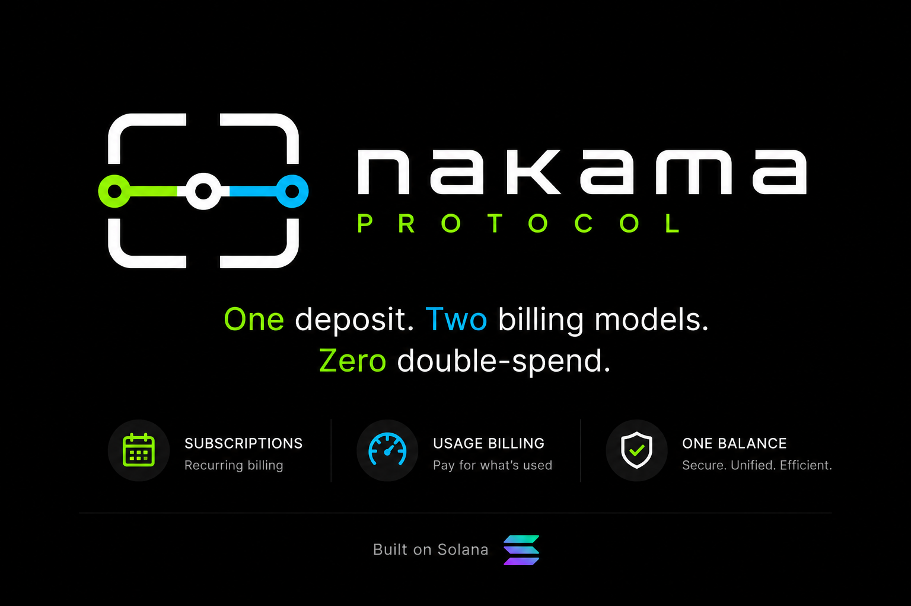

<p align="center">
  
</p>

# Nakama Protocol

*Same escrow, two billing models on Solana.*

> Solana Frontier hackathon submission · Colosseum · Track: Payments & Remittance 

A Solana program that funds a single USDC escrow once at subscribe time, then lets two independent billing layers — recurring streaming subscriptions and x402 per-call micropayments — withdraw from the same parent account without double-spending. One signature, one deposit, one source of truth.

---

## What it is

Nakama is an Anchor 1.0.1 program for merchants who need both predictable monthly billing **and** per-API-call usage charges from the same customer wallet. The subscriber prefunds N periods of USDC into a `Subscription` PDA. From that point on, two writers — a permissionless keeper running `charge` (Sablier-style streaming) and an off-chain facilitator running `settle_usage` (x402 micropayments) — both debit the same `withdrawn_amount` field. The program enforces a single invariant: total withdrawn ≤ total deposited. No second wallet approval, no second escrow, no race between the two billing surfaces.

Target user: a hosted-API merchant who sells a $20/month tier *and* metered overage in one product.

## Why this exists

Streaming-subscription escrows (Sablier, Superfluid) and x402 per-request micropayments (Coinbase x402, Solana facilitator stack) currently live in disjoint contracts. A merchant who wants both must either run two on-chain agreements with two independent wallet approvals, or build a custodial off-chain reconciler. Verified against the public x402 spec (x402.org), Coinbase's facilitator reference implementation, and the Sablier v2-Solana fork: no shipped Solana program reuses one funded escrow as the source of truth for both billing models. Nakama is the smallest correct version of that primitive — one PDA, two writers, no double-spend.

The killer line for the pitch: *one Subscription PDA — funded once at subscribe — feeds both streaming subscriptions (Sablier-style, charged by keeper) for predictable monthly billing, and x402 micropayments (per-API-call) settled by facilitator. Both writers update the same `parent.withdrawn_amount`. No double-spend, no second deposit, no second wallet approval.*

## Architecture overview

```
                  Subscriber wallet (signs once, at subscribe)
                                  │
                                  ▼ prefund N × price USDC
       ┌────────────────────────────────────────────────────────┐
       │  Subscription PDA  (seeds: ["sub", subscriber, plan])  │
       │  ─────────────────────────────────────────────────────  │
       │  state · stream_start · prefunded_until                │
       │  withdrawn_amount   ← single source of truth           │
       │  deposited_amount   ← bumped on subscribe + top_up     │
       └────────────────────────────────────────────────────────┘
                  ▲                                ▲
        charge_handler (keeper)          settle_usage (facilitator)
        ADR-004 streaming math           ADR-x402-001 reservation cap
        seconds-since-start × rate       PaySession satellite PDA
```

Both writers CPI into the same vault TokenAccount and bump `parent.withdrawn_amount` atomically. The x402 layer adds a `PaySession` satellite PDA per active session — a reservation that caps facilitator authority — but never holds funds.

### Subscription FSM

```
                       top_up (from grace)
              ┌───────────────────────────────┐
              ▼                               │
   subscribe ──► Active ──charge exhausts──► GracePeriod ──grace times out──► Exhausted
              │  ▲   │                          │                                │
        pause │  │ resume                       │ cancel                         │ cleanup
              ▼  │                              ▼                                ▼
            Paused ───────cancel──────────► Cancelled ────────cleanup────► (accounts closed)
```

States are an enum-based FSM (`SubscriptionState`: `Active`, `Paused`, `GracePeriod`, `Exhausted`, `Cancelled`) with the transition matrix asserted in tests. `Cancelled` is a soft-terminal tombstone — the account stays observable on-chain until `cleanup` reclaims rent (ADR-013). Satellite PDAs (`PausedSubscription`, `GracedSubscription`) exist if-and-only-if the parent is in the matching state; this bidirectional invariant is enforced in every handler that touches them. The x402 `PaySession` has its own three-state FSM (`Open → Settling → Closed`) and requires `parent.state == Active` to settle.

## The single invariant

Both billing surfaces share one rule, enforced on every withdrawal path (`charge`, `settle_usage`):

```
parent.withdrawn_amount + amount ≤ parent.deposited_amount
```

`deposited_amount` only grows on `subscribe` and `top_up` (subscriber-signed). `withdrawn_amount` only grows on `charge` (keeper) and `settle_usage` (facilitator). Both writers do a checked add against the same field; ordering between the two is irrelevant because each transaction settles against the latest committed state. This is why one escrow can serve two billing models without a coordinator: the parent PDA *is* the coordinator. ADR-x402-001 §"Composability with charge" walks the formal argument; `tests/x402_settle_composability.rs` enforces it under interleaved keeper / facilitator transactions.

## What's built

| Surface | Status | File |
|---|---|---|
| 11 instructions | shipped | `nakama/programs/nakama/src/instructions/` |
| Subscription FSM (Active → GracePeriod → Cancelled / Exhausted, + Paused) | shipped | ADR-003, ADR-006 |
| Streaming charge with grace handover | shipped | ADR-004 |
| Top-up from Active and from GracePeriod | shipped | ADR-007 |
| Cancel by subscriber and by merchant | shipped | ADR-002, ADR-009, ADR-013 |
| Pause / Resume with time-frozen continuity | shipped | ADR-006 |
| x402 PaySession (open, settle, close) sharing parent escrow | shipped | ADR-x402-001 |
| LiteSVM integration tests | 42 files, 169 tests, green | `nakama/programs/nakama/tests/` |
| TypeScript SDK (PDAs, computed status, instruction builders) | shipped | `clients/ts/src/` |
| Off-chain Rust client (account decoding, computed status) | shipped | `crates/nakama-client/` |
| x402 facilitator HTTP harness (axum) | shipped, demo-grade | `crates/nakama-x402-facilitator/` |
| Devnet live demo run (12 confirmed txs, all 11 instructions) | shipped 2026-05-10 | `clients/ts/scripts/demo-log.md` |

Instructions: `create_plan`, `subscribe`, `charge`, `cancel`, `cleanup`, `top_up`, `pause`, `resume`, `open_session`, `settle_usage`, `close_session`.

## What this is not

To pre-empt the obvious questions: this is not a generic streaming-payments contract competing with Sablier — Sablier ships a richer streaming surface but does not host a per-call billing layer on the same escrow. It is also not an x402 facilitator drop-in — Coinbase's facilitator is asset-agnostic and merchant-agnostic, while Nakama is opinionated: USDC, devnet today, one merchant per `Plan`, with a subscription as the precondition for opening sessions. The contribution is the *composition*, enforced on-chain.

## Demo flow

The 3-minute Loom walks one subscriber through every FSM transition against the same `Subscription`. Demo numbers (price = 2 USDC, period = 60 s, prefund = 2 → 4 USDC) are deliberately small so the full lifecycle fits in three minutes; protocol semantics are identical at production-scale numbers (e.g. 10 USDC × 30 days).

1. **Merchant** calls `create_plan` — registers `price = 2 USDC`, `period = 60 s`, mint whitelist = devnet USDC.
2. **Subscriber** calls `subscribe` with `periods_to_prefund = 2` — 4 USDC moves wallet → vault, one signature; state = Active, `rate_per_second = 33 333 µUSDC/s`.
3. **Subscriber** calls `top_up` (+1 period) — vault now holds 6 USDC of runway; state stays Active (ADR-007).
4. **Wait 65 s** — streaming math accrues claimable balance (~2.166 USDC) without any tx.
5. **Keeper** (any signer) calls `charge` — vault → merchant_ata for the unlocked-but-unclaimed delta; monotonic `withdrawn_amount` (ADR-004).
6. **Subscriber** calls `open_session(facilitator, reservation_cap = 0.5 USDC)` — PaySession satellite created, no funds moved.
7. **Facilitator** calls `settle_usage(0.10 USDC)` — first per-API-call charge; **same** `parent.withdrawn_amount` writer as Phase 5 (ADR-x402-001).
8. **Facilitator** calls `settle_usage(0.15 USDC)` — second call; cumulative session usage 0.25 / 0.5 USDC cap.
9. **Subscriber** calls `close_session` — satellite closed, rent reclaimed; subscription continues.
10. **Merchant** calls `pause` then `resume` — time-frozen pause-then-shift (ADR-006); subscriber loses no funds.
11. **Subscriber** calls `cancel` then `cleanup` — pro-rata final settle to merchant + refund of remainder; vault and Subscription accounts closed (ADR-013).

Demo driver: `clients/ts/scripts/00-full-demo.ts` (≤ 700 lines, single file, no retry logic). The deterministic LiteSVM equivalent of steps 1–9 lives at `nakama/programs/nakama/tests/x402_e2e_flow.rs`.

State transitions covered alongside the happy path: pause+resume mid-stream (`adr006_pause_resume.rs`), top-up out of grace (`top_up_grace.rs`), cancel from any FSM state (`cancel_*.rs`), grace-period expiry without intervention (`passive_grace_expiry.rs`), adversarial signer/ATA spoofing (`adversarial.rs`, `top_up_signer_guards.rs`), x402 parent-state guards (`x402_parent_state_guards.rs`).

## Live demo run

Executed on devnet 2026-05-10. **All 11 instructions, 12 confirmed transactions**, both billing surfaces exercising the same parent vault. Roles: merchant + facilitator = `BeNSGCbNZxeGjuMg1dSCQbiuEK4mSdUeG1vT3h31Ly2w`, subscriber = `EkCQAwbcH46VP7JvEPEnxy2Qqh1BNub7VwtpjXroXEDS`.

Two representative txs (full table with all 12 sigs lives in [`clients/ts/scripts/demo-log.md`](clients/ts/scripts/demo-log.md)):

- **Phase 2 — `subscribe`** (one signature, 4 USDC into vault): [`2yuaaa6...`](https://explorer.solana.com/tx/2yuaaa6abSLy889Pr7MBSrrgXfGodNbyUnkTE3ajXux946xrFT3CJiJGkZhNG2dZKAJQ3iB6sLkWjRPxujT2phFU?cluster=devnet)
- **Phase 7 — `settle_usage`** (x402 layer writes to the same vault as streaming `charge`): [`3DEqDjW...`](https://explorer.solana.com/tx/3DEqDjWQ9Mkq5JugkYTVFjUC9c9AH2WipwFnqaP4zNXjdM5UZc7JYzQEXpF8nvx4FnAzgtJFogZpVKRsvGDDztBi?cluster=devnet)

Zero-sum invariant verified: subscriber lost 2.7999 USDC, merchant gained 2.7999 USDC across the run. The parent vault is the single source of truth for both billing surfaces (ADR-002 §"Single escrow").

## Engineering principles

The codebase follows an explicit priority order: **GRASP → KISS → DRY → YAGNI → FSM-first.** Stateful surfaces (Subscription, PaySession) are modelled as enum-based FSMs with the transition matrix asserted in tests. Stateless utilities (PDA derivation, instruction builders, status reads) are kept as pure functions and not pulled into FSM ceremony. Every architectural choice was first written as an ADR, reviewed by a separate architect agent, then re-reviewed by a security-auditor agent before merge. Drift between code and ADR is a blocker, not a follow-up.

Testing is LiteSVM-only — in-process, deterministic, no validator boot. Each instruction has a happy-path file plus an invariants file plus an adversarial file. The FSM transition matrix is enforced by name-mapped test files (e.g., `cancel_from_grace.rs`, `adr006_cancel_from_paused.rs`).

## Security posture

**Honest framing first: this code has been audited by LLM agents, not by a professional security firm. That process caught real bugs (below), but it is NOT a substitute for a professional audit before any mainnet deployment.**

The protocol went through a dedicated multi-agent security cycle (ADR-015) — eight parallel auditors with different lenses (access-control, math-precision, economic-security, invariant-derivation, first-principles, and others) over the full on-chain + off-chain surface. Confirmed findings were fixed and each fix is pinned by a regression test:

- **F1 — pre-init grief on the grace satellite.** Permissionless `charge` with an `Option<Account> + init` slot could be abused to create a zero-initialized satellite while the parent stayed `Active`, bricking later honest exhaustion. Fixed with a bidirectional guard: the satellite account must be present if-and-only-if this charge exhausts the stream (`UnexpectedGraceSatellite` / `MissingGraceSatellite`).
- **F2 — instant drain of grace-recovery top-ups.** `top_up` out of `GracePeriod` raised `deposited_amount` without shifting the streaming anchor, making the entire top-up immediately claimable by the merchant. Fixed: `stream_start` shifts by the time spent in grace, so new funds stream from the recovery moment.
- **F3 — unauthenticated hot-wallet HTTP endpoint.** The x402 facilitator signed transactions from user-supplied input with no auth. Fixed: Bearer auth middleware (fail-closed on missing key), per-request amount cap, loopback bind by default with explicit opt-in for external exposure, keypair accepted via stdin only.
- **F4 — rate truncation bias.** Snapshotting `rate = price / period` at subscribe time accumulated integer-division bias on every streamed second. Fixed: lazy precise math — `(elapsed × price) / period` in u128, divided once at each settle site.
- **F5 — off-chain decode without owner check.** Off-chain readers deserialized accounts without validating `account.owner == program_id`, allowing spoofed-RPC data injection. Fixed: a single `decode_program_owned` chokepoint (owner check, then discriminator check, then Borsh) plus positive 8-byte discriminator `memcmp` filters on `getProgramAccounts`.
- **F6 — legacy RPC encoding misdecode.** `UiAccountData::LegacyBinary` responses are rejected with a typed error instead of being mis-parsed.
- **M2 — typed FSM dispatch.** Off-chain consumers dispatch on a typed state enum with a deny-by-default `Corrupt`/`Unknown` arm, never on raw state bytes.

A follow-up hardening cycle (2026-06-10) re-verified all seven remediations against the code (not the ADR prose), re-derived the core invariants from source — `withdrawn ≤ deposited` under both writers, satellite ⟺ state-byte, stream-anchor continuity under pause/resume, rent always flowing to a validated recipient — and closed the remaining gaps: every reachable `#[error_code]` variant now has a behavioral test trigger, and the cancel telemetry event carries both satellite flags. Two writers (`charge`, `settle_usage`) racing the same escrow cannot double-spend: Solana serializes writes to a mutable account, and both paths gate on the same monotonic `withdrawn_amount`.

Known accepted limitations (demo threat model): the facilitator's Bearer-token comparison is not constant-time (deploy behind a TLS proxy; swap to `subtle::ConstantTimeEq` for production), and the facilitator's computed-status endpoint reads the host clock rather than on-chain time (display-only, never drives a signed transaction).

## Try it yourself

```bash
# Toolchain
rustup install 1.89.0
cargo install --git https://github.com/coral-xyz/anchor --tag v1.0.1 anchor-cli --locked
solana --version   # 2.x or newer

# Clone + build the program
git clone <REPO_URL>
cd Nakama-Sol-x402/nakama
anchor build

# Run the LiteSVM integration suite (no validator required)
cd programs/nakama
cargo test --release
# expected: 169 passed; 0 failed; 0 ignored

# Inspect the deployed devnet program
solana program show HSbykjMFKgX4HhPBdBzDwMBrRVugatiCXrQEC1J9Ccfm \
  --url https://api.devnet.solana.com

# Install the TS SDK (repo ships package-lock.json — use npm, not yarn)
cd ../../../clients/ts
npm install && npm run typecheck
```

Reproduce the live e2e demo against the deployed devnet program:

```bash
# From the repo root: drop a subscriber keypair into .env (base58 string OR JSON byte array)
echo 'PRIVATE_KEY=<your-subscriber-keypair>' > .env

# Then drive all 11 instructions end-to-end (~2.5 min wall-clock)
cd clients/ts
./node_modules/.bin/ts-node scripts/00-full-demo.ts
# expected: 12 confirmed devnet txs, balance check at the end
```

The merchant signer comes from the default Solana CLI keypair (`~/.config/solana/id.json`), which must also be the program's upgrade authority. Both wallets need devnet SOL (≥ 0.05) and ~6 devnet USDC on the subscriber side; the merchant accumulates USDC from the run.

Program ID (devnet): `HSbykjMFKgX4HhPBdBzDwMBrRVugatiCXrQEC1J9Ccfm` (last upgraded slot 461407181, 2026-05-10).
Asset: devnet USDC (`4zMMC9srt5Ri5X14GAgXhaHii3GnPAEERYPJgZJDncDU`). Cluster default: devnet.

## Project layout

```
Nakama-Sol-x402/
├── nakama/                          Anchor workspace
│   └── programs/nakama/
│       ├── src/
│       │   ├── lib.rs               #[program] surface — 11 instructions
│       │   ├── state.rs             Subscription, PaySession, satellites, FSM enums
│       │   ├── error.rs             #[error_code] enum, no unwrap() outside #[cfg(test)]
│       │   ├── constants.rs         seeds, USDC mint, reservation/grace bounds
│       │   └── instructions/        one file per handler (create_plan.rs, charge.rs, …)
│       └── tests/                   LiteSVM integration tests (one file per surface)
├── crates/
│   ├── nakama-client/               off-chain Rust: PDA derivation, account decoding,
│   │                                computed_status (FSM read replica for indexers)
│   └── nakama-x402-facilitator/     axum HTTP harness — POST /settle, /open, /close
└── clients/ts/                      TypeScript SDK: pdas, instruction builders, types
```

## Tech stack

- Rust 1.89.0 (pinned via `rust-toolchain.toml`)
- Anchor 1.0.1 (not 0.30.x — different API)
- `anchor-spl` 1.0.1 for Token CPI
- LiteSVM 0.10.0 + granular Solana SDK v3 (`solana-message` 3.0.1, `solana-transaction` 3.0.2, `solana-signer` 3.0.0, `solana-keypair` 3.0.1)
- TypeScript 5.7.3, `@anchor-lang/core` 1.0.1 (Anchor TS bindings), `@solana/web3.js` 1.95+, `@solana/spl-token` 0.4.9, mocha 9 + ts-mocha 10 + chai 4
- Off-chain Rust services: `solana-rpc-client` 3.1.x, `tokio` LTS, `axum` (facilitator harness)
- Workspace release profile: `lto = "fat"`, `codegen-units = 1`, `overflow-checks = true`

AI dev tooling: Claude Code (Opus + Sonnet), with a 7-agent project setup (architect, reviewer, anchor-engineer, off-chain Rust, SDK, test-engineer, security-auditor) and an ADR pipeline that gates every change through architect-reviewer + security-auditor before merge.

## Future work

Deferred from MVP, with a one-line reason each:

- **Mainnet deployment.** Requires audited build, signer rotation, and a real keeper deployment — out of hackathon scope.
- **Token-2022 freeze handling.** Frozen vaults are detectable but no recovery flow is shipped; current MVP assumes vanilla SPL Token.
- **IDL versioning strategy.** Off-chain readers pin one IDL version; a forward-compat dispatch table is sketched in ADR-001 but not implemented.
- **`getProgramAccounts` pagination beyond 10k subscriptions.** Indexer assumes a small dataset; production needs a Geyser-backed indexer.
- **Refund flow on merchant cancel-and-disappear.** Merchant cancel currently follows the same settle/refund path as subscriber cancel; adversarial merchant edge cases are documented but not stress-tested.
- **x402 facilitator HA.** The facilitator harness is a single axum process; production needs N-of-M signing or a stateless facilitator reading from a queue.
- **Variable-rate plans.** ADR-005 specifies the math; instruction surface is deferred to post-MVP.
- **Clock drift mitigation.** Streaming math reads `Clock::unix_timestamp` directly; tolerable on Solana but worth hardening in production.
- **DoS hardening / rate limiting.** The facilitator has per-request amount caps and auth, but no per-IP rate limiting or abuse throttling; production needs both.
- **Constant-time auth-token comparison.** The facilitator's Bearer check short-circuits on first differing byte; swap to `subtle::ConstantTimeEq` before any non-loopback production deployment.
- **Multi-tenant deployment.** One facilitator process serves one merchant key; multi-merchant isolation (key scoping, per-tenant caps) is undesigned.

## License

MIT. See `LICENSE`.

Submitted to Solana Frontier (Colosseum), Payments & Remittance track, May 2026. Contact via the submission form on Colosseum.
